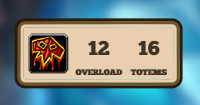

# Shamanic

[Hearthstone Deck Tracker](https://hsdecktracker.net/) plugin for use with the Shaman cards [Thing from Below](http://www.hearthpwn.com/cards/33159-thing-from-below) and [Snowfury Giant](http://www.hearthpwn.com/cards/62918-snowfury-giant).

Displays total mana crystals overloaded and totems played for both the player and opponent.

## Installation

- [Download](https://hsdecktracker.net/download/) and install the latest version of Hearthstone Deck Tracker 
- [Download](https://github.com/batstyx/shamanic/releases/latest) the latest release of Shamanic
- Follow the Hearthstone Deck Tracker FAQ [plugin installation instructions](https://github.com/HearthSim/Hearthstone-Deck-Tracker/wiki/Available-Plugins)
