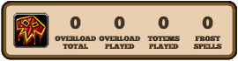

## This Plugin Is Deprecated

# Shamanic

[Hearthstone Deck Tracker](https://hsdecktracker.net/) plugin for use with the Shaman cards:- 

- **Murder at Castle Nathria**
  - [Gigantotem](https://hearthstone.blizzard.com/en-gb/cards/78525-gigantotem)
- **Fractured in Alterac Valley**
  - [Bearon Gla'shear](https://hearthstone.blizzard.com/en-gb/cards/67778-bearon-glashear)
- **United in Stormwind**
  - [Charged Call](https://hearthstone.blizzard.com/en-gb/cards/64356-charged-call)
  - [Command the Elements](https://hearthstone.blizzard.com/en-gb/cards/64322-command-the-elements)
- **Knights of the Frozen Throne**
  - [Snowfury Giant](https://hearthstone.blizzard.com/en-gb/cards/42765-snowfury-giant)
- **Whispers of the Old Gods**
  - [Thing from Below](https://hearthstone.blizzard.com/en-gb/cards/38267-thing-from-below)

Displays counters for both the player and opponent for:-

- Overload Total: Total Mana Crystals Overloaded
- Overload Played: Overload Cards Played
- Totems Played
- Frost Spells [Played]

Counters can be displayed for player and opponent:-

- Always
- Shaman
- Class (Priest/Rogue/Shaman)
- Card (Player only)
- Never

## Installation

- [Download](https://hsdecktracker.net/download/) and install the latest version of Hearthstone Deck Tracker 
- [Download](https://github.com/batstyx/shamanic/releases/latest) the latest release of Shamanic
- Follow the Hearthstone Deck Tracker FAQ [plugin installation instructions](https://github.com/HearthSim/Hearthstone-Deck-Tracker/wiki/Available-Plugins)
